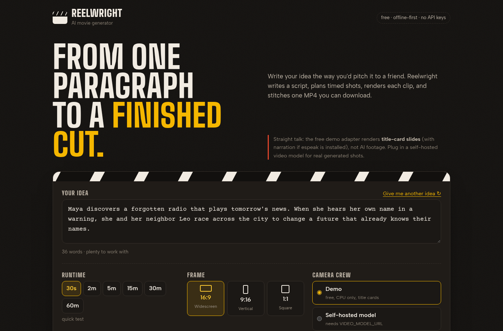
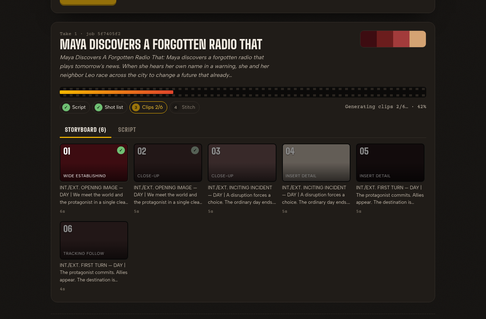
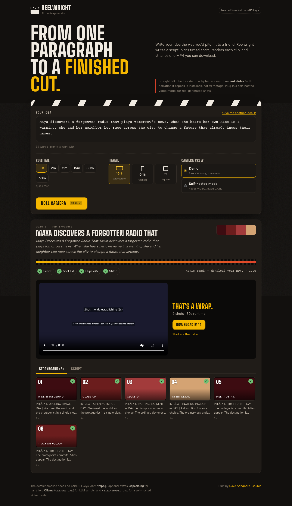

# Reelwright · AI Movie Generator

Write a paragraph about a story. Reelwright turns it into a short screenplay, a timed shot list, one clip per shot, and a single MP4 you can download. It runs on free tools only (Node + ffmpeg), so you can try it on a laptop with no GPU and no API keys.

I built it for people who want to prototype short films, explainers, or storyboards fast, and as a clean example of a multi-stage media pipeline (script → plan → render → stitch) with a job queue and a live progress UI.

> **Straight talk:** the default **demo adapter** renders title-card slides (with narration if `espeak` is installed), not AI footage. Point `VIDEO_MODEL_URL` at a self-hosted open video model to get real generated shots. Nobody offers a trustworthy free "make me a finished hour-long film" button, and this app doesn't pretend to.

| Writing the pitch | Rolling | That's a wrap |
|---|---|---|
|  |  |  |

### What the UI does
- A clapperboard "slate" form: idea shuffler, runtime chips (30s to 60m), frame picker (16:9 / 9:16 / 1:1), and a choice of camera crew (demo or self-hosted model)
- **Ctrl/⌘ + Enter** rolls camera from anywhere in the form
- A film-strip progress bar with step pills (script → shot list → clips N/M → stitch)
- A storyboard that fills in shot by shot, and a screenplay-formatted script tab
- An inline player for the finished MP4, plus a download button
- Responsive, keyboard friendly, visible focus states, and colors that pass contrast checks

### One-command start
```bash
./run.sh          # install, build, serve on http://localhost:3000
./run.sh dev      # hot-reload dev server
./run.sh test     # unit + stitch smoke tests
```

## Features

- Synopsis → template scriptwriter (optional **Ollama** if `OLLAMA_URL` is set)
- Shot planner with durations that **sum to the target** (demo 30s–5m; setting up to 60m)
- Character / style **bible** per job, injected into clip prompts
- Clip adapters:
  - **demo** — ffmpeg color slides + optional `espeak`/`espeak-ng` TTS
  - **http** — stub for CogVideoX-style self-hosted endpoints (`VIDEO_MODEL_URL`)
- **ffmpeg** stitcher → downloadable MP4
- In-process job queue with filesystem persistence (`jobs/`, `outputs/`)
- Progress UI: script → shots → clips N/M → stitch → download

## Requirements

- Node.js 20+
- **ffmpeg** on `PATH` (required)

```bash
# Debian/Ubuntu
sudo apt update && sudo apt install -y ffmpeg

# Optional TTS for demo clips
sudo apt install -y espeak-ng
```

## Quick start

```bash
git clone https://github.com/Dave-4u/ai-movie-generator.git
cd ai-movie-generator
npm install
npm run dev
```

Open [http://localhost:3000](http://localhost:3000). Paste a synopsis, pick duration / aspect, hit **Roll camera**.

### Scripts

| Command | Purpose |
|--------|---------|
| `npm run dev` | Next.js dev server |
| `npm run build` / `npm start` | Production build & serve |
| `npm test` | Shot timing math + stitch smoke tests |
| `npm run demo:movie` | CLI smoke: tiny MP4 via demo adapter |

## Architecture

```
synopsis
   │
   ▼
scriptwriter  ──► MovieScript + StyleBible
   │
   ▼
shot-planner  ──► ShotList (durations sum ≈ target)
   │
   ▼
clip-generator adapters (demo | http)
   │
   ▼
stitcher (ffmpeg concat) ──► outputs/<jobId>.mp4
```

| Module | Path | Role |
|--------|------|------|
| Scriptwriter | `src/lib/scriptwriter` | Template beats from synopsis; optional Ollama |
| Shot planner | `src/lib/shot-planner` | Split scenes into timed shots |
| Bible | `src/lib/bible` | Characters, palette, mood, camera language |
| Clip adapters | `src/lib/clip-generator` | `DemoClipAdapter`, `HttpClipAdapter` |
| Stitcher | `src/lib/stitcher` | ffmpeg concat → MP4 |
| Jobs | `src/lib/jobs` | Queue + `jobs/<id>/job.json` persistence |
| UI | `src/components/MovieGenerator.tsx` | One-shot generate + progress |
| API | `src/app/api/jobs` | Create / poll / download |

## Free vs self-hosted backends

| Path | Cost | Notes |
|------|------|--------|
| **Demo adapter (default)** | Free | ffmpeg slides; works offline; no API keys |
| **Ollama scriptwriter** | Free (local) | Set `OLLAMA_URL` (e.g. `http://127.0.0.1:11434`); falls back to templates |
| **HTTP video adapter** | Free if you host it | Set `VIDEO_MODEL_URL` to your open model server; falls back to demo on failure |

### HTTP adapter contract

`POST {VIDEO_MODEL_URL}/generate`

```json
{
  "prompt": "…",
  "duration_seconds": 6,
  "width": 1280,
  "height": 720,
  "negative_prompt": "…",
  "shot_id": "shot-1"
}
```

Response: raw `video/mp4` body, or JSON `{ "video_base64": "…" }` / `{ "url": "…" }`.

Point this at a CogVideoX / similar self-hosted worker when you have one.

## Scaling toward ~1 hour

1. Use target **60 min** in the UI (shot planner expands scene/shot counts).
2. Expect **many** clips — demo slides are cheap; real video models are slow/VRAM-heavy.
3. Run the job on a machine with disk for `jobs/` + `outputs/`.
4. For production: move the queue to a worker process, generate clips in parallel with a GPU pool, and store outputs in object storage.
5. Keep the bible stable across shots so characters/style don’t drift.

## Environment (all optional)

```bash
# Optional local LLM for scripts
OLLAMA_URL=http://127.0.0.1:11434
OLLAMA_MODEL=llama3.2

# Optional self-hosted video model
VIDEO_MODEL_URL=http://127.0.0.1:8000
```

No paid keys are required for the default path.

## Tech stack
Next.js 15 (App Router) · React 19 · TypeScript · Tailwind v4 + hand-written CSS · ffmpeg · optional Ollama / espeak-ng

## Roadmap
- [ ] Move the queue into a separate worker so long renders survive restarts
- [ ] Parallel clip rendering on a GPU pool
- [ ] Edit individual shots and re-render only those
- [ ] Background music bed and subtitles (SRT) in the final cut
- [ ] Hosted demo with a tiny 30s cap

## License

MIT, see [LICENSE](LICENSE).
